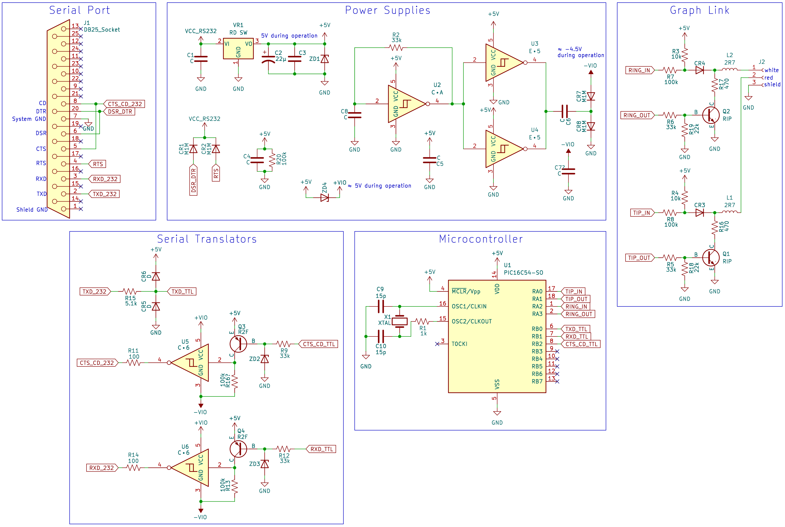

TI-Graph Link adapters
----------------------
This repository contains information about three types of TI-Graph Link adapters:
* [TI-Graph Link serial (gray)](#ti-graph-link-serial-gray)
* [TI-Graph Link serial (black)](#ti-graph-link-serial-black)
* [TI USB Graph Link (silver)](#ti-usb-graph-link-silver)

Building Firmware
-----------------
The included makefile build system can build both the Silver Link "B" and the serial Gray Link firmware. The resulting .eep file should be bit-compatible with the EEPROM contents.

Silver Link build dependencies are:
 * [sdcc](http://sdcc.sourceforge.net): versions 3.8.0 through 4.2.0 have been tested
 * [GNU make](https://www.gnu.org/software/make/)
 * Python 3: for the script which generates the Autoexec header and checksum

Gray Link build dependencies are:
 * [gputils](https://gputils.sourceforge.io/): version 1.5.2 has been tested
 * [GNU make](https://www.gnu.org/software/make/)

```sh
$ make
sdas8051 -lops ti_graph_link_silver.asm
sdcc -mmcs51 --code-size 0x1400 ti_graph_link_silver.rel -o ti_graph_link_silver.hex
makebin -p ti_graph_link_silver.hex ti_graph_link_silver.bin
./tools/generate_eeprom.py ti_graph_link_silver.bin ti_graph_link_silver.eep
gpasm  -o ti_graph_link_serial_gray.hex ti_graph_link_serial_gray.asm
ti_graph_link_silver.bin: OK
ti_graph_link_serial_gray.hex: OK
```

TI-Graph Link serial (gray)
---------------------------
The gray TI-Graph Link cable uses a DB-25 serial connector and works with Windows and Macintosh computers. It includes adapters to connect to DB-9 RS232 serial port on a PC and a DIN adapter to connect to RS-422 serial port on a Mac. [Merthsoft's Link Cables page](http://merthsoft.com/linkguide/cable.html#greytigl) contains additional information about this cable.


## Gray Link: Schematic
Full schematic is included in the repository as [TI-Graph Link serial (gray) PDF](schematics/ti_graph_link_serial_gray/ti_graph_link_serial_gray_rev1.pdf) or KiCad.


The control of the cable is provided with a PIC16C54 which receives requests on serial TX, sends responses back on serial RX, and manages the graph link communication on the tip/ring of the 2.5mm cable through two pairs of pins. There are three power supplies on board: 5V regulator for the PIC and graph-link communication and positive and negative voltages for the RS232 communication with the host.

### Gray Link: GPIO connectivity
Graph Link   | Direction | GPIO | IC Pin
-------------|-----------|------|-------
Tip (red)    | In        | RA0  | 17
Tip (red)    | Out       | RA1  | 18
Ring (white) | In        | RA2  | 1
Ring (white) | Out       | RA3  | 2

Notable parts:
* `U1`: PIC16C54
* `VR1`: 5V regulator, likely similar to TelCom TC55
* `CR3`/`CR4`: `M1M` diodes to supply power from RTS/DSR/DTR control lines
* `U2`, `U3`, `U4`, `U5`, `U6`: variants of Schmitt trigger inverter

TI-Graph Link serial (black)
----------------------------
The black serial Graph Link cable was the later revision with a female DB-9 connector and is only intended to work with Windows PCs.


## Black Link: Schematic
Full schematic is included in the repository as [TI-Graph Link serial (black) PDF](https://raw.githubusercontent.com/queueRAM/ti_graph_link/main/schematics/ti_graph_link_serial_black/ti_graph_link_serial_black_schematic_rev1.pdf) or KiCad.


* `CNTR`: connector for serial port control lines
* `CR3`/`CR4`: `M1M` diodes to supply power from RTS/DTR control lines
* `C1`/`C2`: bypass caps
* `U1`: [LM339AM](https://www.ti.com/lit/ds/symlink/lm339.pdf) single supply quad comparator
* `CR6`/`CR7`/`CR8`: diodes for inverting input and pullups
* `R6`/`R10`: pullups for inverting input and link port
* `R1`/`R2`/`R3`/`R4`/`R5`/`R7`/`R8`/`R9`: graph link circuitry around LM339
* `JACK`: 2.5mm 3-conductor graph link jack

TI USB Graph Link (Silver)
--------------------------

There are two hardware models of the Silver Graph Link USB cable: "A" and "B" as denoted by the last character of its production code. Most graph link cables contain a production code on the back label in the following format: `FMMYYH`:
 * `F` - Factory: `I` (Taiwan), `S` (China), `P` (China)
 * `MM` - Month of manufacture
 * `YY` - Year of manufacture
 * `H` - Hardware: either "A" or "B" (see description below)

The "A" version uses a Cypress CY7C64013 chipset and was manufactured from sometime in the early 2000s through March 2003. Starting around April 2003 through 2010, the "B" hardware version using the TI TUSB3410 was manufactured.

## Silver Link "A": Cypress CY7C64013

Some info about the "A" TI Silver Link is documented here: http://merthsoft.com/linkguide/usbdevices/SilverLink%20USB.txt


### Silver Link "A": Schematic

Full schematic is included in the repository as ["A" Rev 1 PDF](https://raw.githubusercontent.com/queueRAM/ti_graph_link/main/schematics/ti_silver_link_a/ti_silver_link_a_rev1.pdf) or KiCad.


* `D1`: `D3G` Rohm Schottky barrier diode [RB471E (PDF)](http://rohmfs.rohm.com/en/products/databook/datasheet/discrete/diode/schottky_barrier/rb471et148-e.pdf)
* `L4`, `L4`: `2R7` 2.7µH inductor
* `U1`: `DQF` Voltage Regulator, 3.3V [S-812XXSG (PDF)](http://www.sih.com.hk/sih_eng/products/ic/pdf/s812-e.pdf) (81233SGUP)
* `U2`: `H8` Rohm Bias resistor transistor [IMH8A (PDF)](http://rohmfs.rohm.com/en/products/databook/datasheet/discrete/transistor/digital/umh8ntr-e.pdf)
* `U3`: `CY7C64013` Cypress USB [CY7C64013,113 (PDF)](https://media.digikey.com/pdf/Data%20Sheets/Cypress%20PDFs/CY7C64013,113.pdf)
* `X1`: `6.0F2D` 6MHz Crystal

### Cypress CY7C64013

Cypress M8 Series (M8 Core w/ 8K EPROM)

The CY7C64013 is a Full-Speed USB microcontroller made by Cypress. It uses a 6MHz external clock source.
The CPU uses a proprietary 8-bit RISC M8 architecture and is clocked at 12MHz.

* [Cypress Website on CY7C64013](https://web.archive.org/web/20010405082135/http://www.cypress.com/cypress/prodgate/usb/cy7c64x13.htm)
* [Cypress Website about USB Programming Tools](https://web.archive.org/web/20010617083043/http://www.cypress.com/design/progprods/usb/usbprog.html)

### GPIO connectivity
Graph Link   | GPIO  | SOIC Pin
-------------|-------|---------
Tip (red)    | P0[0] | 17
Ring (white) | P0[1] | 13

## Silver Link "B": TI TUSB3410


### Silver Link "B": Schematic
Full schematic is included in the repository as ["B" Rev 3 PDF](https://raw.githubusercontent.com/queueRAM/ti_graph_link/main/schematics/ti_silver_link_b/ti_silver_link_b_rev3.pdf) or KiCad.


* `D1`: `D3G` Rohm dual Schottky barrier diode [RB471E (PDF)](http://rohmfs.rohm.com/en/products/databook/datasheet/discrete/diode/schottky_barrier/rb471et148-e.pdf)
* `D2`: `3F` Chenmko Schottky barrier diode [CH461FGP (PDF)](http://www.chenmko.com.tw/assets/uploaded_docs/1310112518k0vqy.pdf)
* `L1`, `L2`: `2R7` 2.7µH inductor
* `U1`: `24LC64` 64kbit EEPROM: Microchip [24LC64 (PDF)](https://ww1.microchip.com/downloads/en/DeviceDoc/21189T.pdf)
* `U2`: `AQI` TI LDO Regulator, 3.3V [TPS715 (PDF)](https://www.ti.com/lit/ds/symlink/tps715.pdf) (TPS71533DCKR)
* `U3`: `TUSB3410` USB TI [TUSB3410 (PDF)](https://www.ti.com/lit/ds/symlink/tusb3410.pdf)
* `U4`: `H8` Rohm Bias resistor transistor [IMH8A (PDF)](http://rohmfs.rohm.com/en/products/databook/datasheet/discrete/transistor/digital/umh8ntr-e.pdf)
* `Y1`: `12.0F4K` 12MHz Crystal

### GPIO connectivity
Graph Link   | GPIO | VQFN Pin
-------------|------|---------
Tip (red)    | P3.3 | 30
Ring (white) | P3.4 | 29

### EEPROM data

The EEPROM data contains a header which is first read by the bootloader in the TUSB3410 ROM. If the header matches the expected format, the size as is described in the header is read out from the EEPROM into Code RAM. The bootloader then jumps to this code.

#### Autoexec Binary Firmware:
OFFSET | TYPE                 | SIZE   | VALUE | DESCRIPTION
-------|----------------------|--------|-------|--------------------------
0x0000 | Signature0           | 1      | 0x10  | FUNCTION_PID_L
0x0001 | Signature1           | 1      | 0x34  | FUNCTION_PID_H
0x0002 | Data Type            | 1      | 0x07  | Autoexec binary firmware
0x0003 | Data Size(low byte)  | 1      | 0x00  | 0x1400 bytes of application code
0x0004 | Data Size(high byte) | 1      | 0x14  |
0x0005 | Check Sum            | 1      | 0x5a  | Checksum of the following firmware
0x0006 | Program              | 0x1400 |       | Binary application code
0x1406 | Data Type            | 1      | 0x00  | End of header

### Silver Link "B": Firmware
TUSB3410 contains an 8052 microprocessor. The application code contained within the EEPROM
is responsible for receiving commands over USB and communicating with the calculator over its
PORT3 GPIO.

TI USB Graph Link Breadboard Edition
------------------------------------

User ["okrayo" on the Cemetech forums](https://www.cemetech.net/forum/viewtopic.php?p=302975#302975) recreated the TI USB Graph Link "B" on a breadboard using a TUSB3410 and through-hole alternatives for the power supply, transistors, diodes, and passive components. Since this uses the same USB chipset and firmware as the official Silver USB Graph-Link, this works with existing SW and TI graphing calculators with 2.5mm data port.


## Component Replacements

The table below enumerates the part replacements that "okrayo" used in the design relative to the original "B" schematic. In addition to these parts, the following modifications were made:
 - Added 0.1µF decoupling capacitor between 1V8 and GND
 - Removed the `L2`/`C9` `L1`/`C10` filter on tip and ring connections
 - Added LED + 330Ω resistor on 3V3
 - Left 24LC256 `WP` pin disconnected to prevent inadvertent writes

RefDes  | Description          | "B" Part    | Breadboard Part
--------|----------------------|-------------|------------------
C1/C5   | Xtal caps            | 33pF SMT    | 22pF through-hole
D2      | Suspend Diode        | CH461FGP    | [1N4148](https://en.wikipedia.org/wiki/1N4148_signal_diode)
R8/R9   | USB D+/D- Res.       | 22Ω         | 27Ω
R20/R21 | 1V8 voltage divider  | 90.5k/100kΩ | 15k/18kΩ
R24     | VREGEN Resistor      | 32.4kΩ      | 33kΩ
U2      | 3.3V volt. regulator | TPS71533    | [MCP17003302E](https://www.microchip.com/en-us/product/MCP1700)
U4      | Transistors          | IMH8A       | 2x [PN2222A](https://www.onsemi.com/pdf/datasheet/p2n2222a-d.pdf)
U1      | EEPROM               | 24LC64      | [24LC256](https://www.microchip.com/en-us/product/24LC256)
D1      | Schottky Diodes      | RB471E      | 2x [MBR150](https://www.onsemi.com/pdf/datasheet/mbr150-d.pdf)

## TI USB Graph Link Breadboard Edition: Schematic

Full schematic is included in the repository as [TI Graph-Link "okrayo" Breadboard PDF](https://raw.githubusercontent.com/queueRAM/ti_graph_link/main/schematics/ti_silver_link_breadboard/ti_silver_link_okrayo_breadboard_rev3.pdf) or KiCad.

